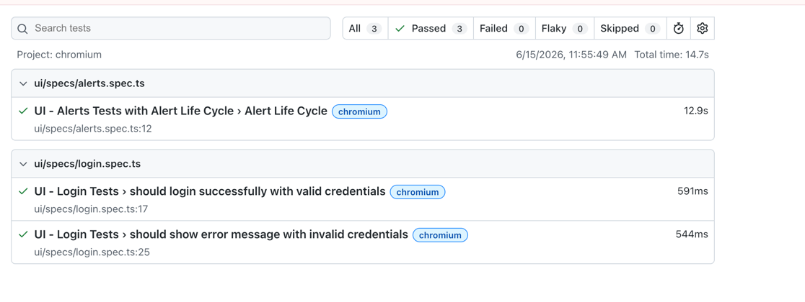

# Playwright Test Framework

A comprehensive end-to-end testing framework built with Playwright, supporting both API and UI testing for automation and quality assurance.

## Project Overview

This project provides a robust testing infrastructure for:
- **API Testing**: Automated testing of REST API endpoints
- **UI Testing**: Browser-based testing with Chromium and other browsers
- **Test Management**: Organized test suites with fixtures and utilities

## UI Testing Strategy: Fixtures for Efficiency

To optimize test execution speed and focus on testing what matters, we leverage Playwright fixtures for test setup and teardown. Our UI tests use a fixture-based approach that handles:

- **Login**: Fixtures automatically authenticate users before tests run, eliminating redundant login flows across multiple tests
- **Scan**: Pre-configured test state ensures tests start with the data they need, avoiding unnecessary setup steps
- **Cleanup**: Fixtures handle post-test cleanup, removing test data and resetting state without adding overhead to each individual test

This approach significantly reduces test execution time by eliminating repeated UI interactions for common setup tasks, allowing tests to focus on the specific functionality being validated rather than prerequisites. The result is a faster, more maintainable test suite that provides comprehensive coverage without the performance penalty of redundant user workflows.

### Page Object Model Structure

Our UI tests follow a modular page object model where each section of the application is represented as a separate page class. Each page encapsulates:

- **Page-specific selectors and actions**: All interactions for a particular screen or section are self-contained
- **Navigation methods**: Pages implement `navigatePage()` methods that handle transitions between screens and return the next page object
- **Fluent navigation**: This allows tests to chain page transitions intuitively, moving from one page to the next in a natural, readable way

For example, a test might flow like: `loginPage.login() → dashboardPage → navigateToAlerts() → alertsPage`, where each navigation method handles the transition and returns the destination page. This structure keeps tests clean, maintainable, and focused on the user journey rather than implementation details.

### Isolated Client Management

Each page or section has its own dedicated client instance to ensure proper separation of concerns and prevent cross-page interference. This isolation provides:

- **Independent state**: Each page maintains its own client, preventing state leakage between different sections
- **Clear dependencies**: Page clients are self-contained, making it obvious what each page depends on
- **Easier debugging**: Issues are isolated to specific pages since they don't share client instances
- **Parallel test safety**: Isolated clients reduce conflicts when tests run in parallel

This design pattern ensures that interactions with one page don't inadvertently affect another, making tests more reliable and easier to reason about.

## API Testing with Environment Configuration

Our API tests utilize environment-based configuration files to manage all baseline values in a single, centralized location. This approach provides several key benefits:

- **Environment-specific configurations**: Create separate configuration files for different environments (dev, staging, production) with corresponding values for API endpoints, credentials, timeouts, and other parameters
- **Single source of truth**: All API values—base URLs, authentication tokens, default headers, request timeouts—are defined in the env configuration file
- **Easy maintenance**: Update API endpoints, credentials, or other baseline values in one place without modifying individual test files
- **Environment switching**: Seamlessly switch between environments by pointing to the appropriate configuration file

By centralizing configuration, tests remain flexible and adaptable to different environments without hardcoding values throughout the codebase. This makes it simple to run the same test suite against multiple environments and significantly reduces the maintenance burden when infrastructure details change.

### Flow Lifecycle Helpers

For complex workflows that span multiple pages or API interactions, dedicated helper functions encapsulate entire flows (such as `alertLifeCycle`). These helpers provide:

- **Workflow abstraction**: Complex multi-step processes are wrapped in single, reusable functions, hiding implementation details from tests
- **Reduced duplication**: Common workflows used across multiple tests are defined once and reused everywhere
- **Improved readability**: Tests focus on intent rather than step-by-step mechanics, making test code more expressive and easier to understand
- **Single point of maintenance**: Changes to a workflow only need to be made in one place, reducing the risk of inconsistencies
- **Faster test development**: New tests can leverage existing helpers instead of reimplementing workflows, accelerating test creation
- **Better test organization**: Helpers group related operations together, creating a clear, logical structure for the test suite

For example, an `alertLifeCycle` helper might handle the entire flow of creating an alert, configuring it, triggering it, and verifying the response—allowing tests to call a single function instead of orchestrating each step manually.

## Test Configuration and Debugging

### Headless Mode Control

Tests are configured to run in headless mode by default for faster, background execution. However, you can easily toggle this for debugging:

```bash
# Run tests in headless mode (default)
npm test

# Run tests with browser visible for debugging
HEADLESS=false npm test
```

The configuration uses `headless: process.env.HEADLESS !== 'false'`, allowing you to quickly switch to headed mode without modifying test files. This is particularly useful for debugging test failures or observing test behavior in real-time.

### Automatic Failure Screenshots

When tests fail, Playwright automatically captures a screenshot of the page at the moment of failure. These screenshots are included in the test report and stored alongside test artifacts, making it easy to visually diagnose what went wrong without needing to rerun tests or manually inspect the application state.

## Playwright Configuration

The `playwright.config.ts` file controls all aspects of how Playwright runs your tests. Here are the key settings you can customize:

### Core Settings

- **`testDir`**: Directory where test files are located (`./src/tests`)
- **`fullyParallel`**: Whether all tests run in parallel. Set to `false` to run tests sequentially (good for avoiding resource conflicts)
- **`workers`**: Number of parallel workers. Set to `1` for sequential execution, or higher for parallel runs
- **`retries`**: Number of times failed tests are retried (useful in CI to catch flaky tests)

### Reporting & Debugging

- **`reporter`**: Test report format (`html` generates the interactive Playwright report)
- **`trace`**: Records traces for debugging (`on-first-retry` only records on retried tests to save storage)
- **`screenshot`**: Captures screenshots (`only-on-failure` captures only when tests fail)

### Browser & Device Configuration

The **`projects`** section defines which browsers to run tests on. You can:
- Add multiple browsers (Chromium, Firefox, Safari)
- Configure browser-specific settings
- Set **`headless`**: Controls whether the browser is visible during test execution
  - `headless: false` - See the browser run (useful for debugging)
  - `headless: true` - Run invisible in background (faster for CI)

### Base URL & Server

- **`baseURL`**: Default URL for all tests (loaded from your env config)
- **`webServer`**: Automatically starts your dev server before tests run, reusing existing instances in local development

### Timeout Configuration

- **`timeout`**: Global timeout for all tests (add this to prevent tests from hanging indefinitely)

Example: `timeout: 180000` sets a 3-minute timeout for all tests. You can also set per-project or per-test timeouts for more granular control.

# Test Report - Playwright Test Framework




## Running Tests

### Test Commands

We've organized test execution into separate, focused commands to allow developers to run only the tests they need:

```bash
# Run all tests (both API and UI)
npm test

# Run API tests only
npm run test:api

# Run UI tests only
npm run test:ui

# Run specific UI test suites
npm run test:ui:alerts
npm run test:ui:login
```

**Why separate commands?**
- **Faster feedback**: Developers can run just the API or UI tests relevant to their changes without waiting for the full suite
- **Parallel development**: API and UI teams can run their tests independently without blocking each other
- **Focused debugging**: When a specific layer fails, you can isolate and debug it without running the entire test suite
- **CI/CD efficiency**: Pipelines can run API and UI tests in parallel for faster overall execution

### How This Report is Generated

The report is automatically created when you run tests using any of the commands above. Playwright automatically captures test results, execution times, screenshots, and logs, then generates an interactive HTML report.

---

## How to View the Report

After running tests, view the interactive HTML report:

```bash
npx playwright show-report
```

This opens the full report in your browser where you can:
- Filter tests by status (Passed, Failed, Flaky, Skipped)
- Search for specific tests
- View detailed test information
- See screenshots and logs
- Check execution times

The report files are saved in the `playwright-report/` directory.